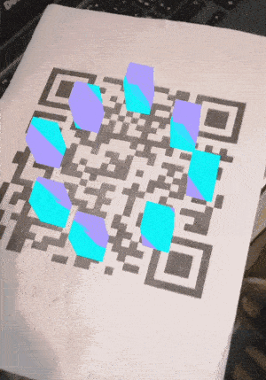

# musicVisualizerAR

An augmented reality music visualization app, for now it's just a demo so it has 3 predefined songs.

## Screenshot:

## App logic:
Point the camera towards the target and enjoy the visuals!

## Tools used:
* Visual studio Code (Text Editor)
* C# (logic)
* Unity (game engine)
* Easy AR (Augmented Reality SDK)
* Paint.Net (Image editting)

## Contribution:
Feel free to `fork` this project and add whatever you like. If you have any suggestions or any comments please feel free to contact me or to open an issue, use free license art assets please.

## Team:
[Jetlighters](https://github.com/JetLightStudio) having fun.
